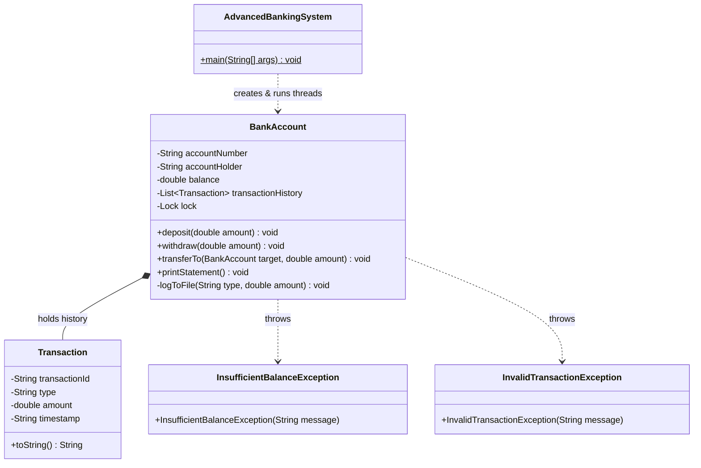

# Advanced Banking System

[](https://www.oracle.com/java/)
[](LICENSE)
[](#thread-safety--concurrency)
[](#getting-started)

This is an advanced, multi-threaded Java console application implementing a comprehensive banking system, with emphasis on object-oriented principles, custom exception handling, thread-safe concurrency, deadlock prevention algorithms, and audit logging capabilities.

---

## Table of Contents

- [Features](#-features)
- [Design](#-design)
- [Concurrency](#-concurrency)
- [Project Structure](#-project-structure)
- [Getting Started](#-getting-started)
  - [Requirements](#requirements)
  - [Compilation & Execution](#compilation--execution)
- [Output Sample](#-output-sample)
- [Audit Logging](#-audit-logging)
- [Roadmap](#-roadmap)
- [Contributing](#-contributing)
- [License](#-license)

---

### Key Characteristics

-  **Thread-Safe Account Management**: Uses `ReentrantLock` per account to ensure that deposits, withdrawals, and balance checking happen atomically in highly concurrent scenarios.
-  **Preventing Deadlocks in Multi-Account Transfers**: Ensures no deadlock by deterministic locking using hash codes in order to perform multi-account transfers concurrently.
-  **Transactional History Log**: Keeps track of all transactions of types `INITIAL`, `DEPOSIT`, `WITHDRAW`, `TRANSFER IN`, `TRANSFER OUT` and timestamps them using short UUIDs.
-  **Real-Time Audit Log**: Append-only log in `bank_audit.log` with timestamped data about all financial transactions.
-  **Custom Exceptions for Domain-Level Error Handling**: Provides `InsufficientBalanceException` and `InvalidTransactionException`.
-  **No External Dependencies**: Pure Java (Core SE).

---

##  Architecture & Design



---

### Thread Safety and Avoiding Deadlock

If two accounts, Account A and Account B, transfer money to each other simultaneously on multiple worker threads, then the circular-wait condition for deadlock arises where Thread 1 locks A and waits for B while Thread 2 locks B and waits for A.

The following design avoids the deadlock by implementing **locking order**:

```java
// Lock ordering based on identity hash code ensures consistent acquisition order across all threads
BankAccount firstLock  = this.hashCode() < targetAccount.hashCode() ? this : targetAccount;
BankAccount secondLock = this.hashCode() < targetAccount.hashCode() ? targetAccount : this;

firstLock.lock.lock();
secondLock.lock.lock();
try {
    this.withdraw(amount);
    targetAccount.deposit(amount);
} finally {
    secondLock.lock.unlock();
    firstLock.lock.unlock();
}
```

---

##  Project Structure

```text
Advanced-Banking-System/
├── src/
│   └── AdvancedBankingSystem.java   # Core implementation and concurrent demo
├── bank_audit.log                   # Generated transaction audit logs (runtime)
├── LICENSE                          # MIT License
└── README.md                        # Documentation
```

---

## Getting Started

### Prerequisites

- **Java Development Kit (JDK)**: Version 8 or later (Java 11, 17, 21 LTS recommended).
- Git (optional for cloning).

Check your Java setup:
```bash
java -version
javac -version
```

### Compilation and Execution

1. **Cloning the repository:**
   ```bash
   git clone https://github.com/Sabareesh-06/Advanced-Banking-System.git
   cd Advanced-Banking-System
   ```

2. **Compiling the source code:**
   ```bash
   javac src/AdvancedBankingSystem.java
   ```

3. **Executing the program:**
   ```bash
   java -cp src AdvancedBankingSystem
   ```

---

## Sample Output

```text
=== Account Statement: ACC-1001 (Alice) ===
[2026-09-25 23:00:00] ID: 4a2f8b1c | Type: INITIAL  | Amount: $1500.00
[2026-09-25 23:00:00] ID: 8c1d9e2a | Type: DEPOSIT  | Amount: $500.00
[2026-09-25 23:00:00] ID: e3f12a90 | Type: WITHDRAW | Amount: $300.00
[2026-09-25 23:00:00] ID: b7d6124f | Type: TRANSFER OUT | Amount: $300.00
[2026-09-25 23:00:00] ID: f41e8c02 | Type: WITHDRAW | Amount: $200.00
[2026-09-25 23:00:00] ID: 90a1bc33 | Type: TRANSFER OUT | Amount: $200.00
Current Balance: $1500.00
================================================

=== Account Statement: ACC-1002 (Bob) ===
[2026-09-25 23:00:00] ID: 1a9f0e34 | Type: INITIAL  | Amount: $500.00
[2026-09-25 23:00:00] ID: d8c71b2a | Type: WITHDRAW | Amount: $150.00
[2026-09-25 23:00:00] ID: 77a0bc21 | Type: DEPOSIT  | Amount: $300.00
[2026-09-25 23:00:00] ID: 2b8a7c11 | Type: TRANSFER IN  | Amount: $300.00
[2026-09-25 23:00:00] ID: 5f190c4d | Type: DEPOSIT  | Amount: $200.00
[2026-09-25 23:00:00] ID: 88ef1a43 | Type: TRANSFER IN  | Amount: $200.00
Current Balance: $850.00
================================================
```

---

##  Audit Logging

All transactions automatically record to `bank_audit.log`:

```log
[2026-09-25T23:00:00.123] Account: ACC-1001 | Action: DEPOSIT | Amount: $500.00 | New Balance: $2000.00
[2026-09-25T23:00:00.125] Account: ACC-1002 | Action: WITHDRAW | Amount: $150.00 | New Balance: $350.00
[2026-09-25T23:00:00.128] Account: ACC-1001 | Action: WITHDRAW | Amount: $300.00 | New Balance: $1700.00
[2026-09-25T23:00:00.129] Account: ACC-1002 | Action: DEPOSIT | Amount: $300.00 | New Balance: $650.00
```

---

## Future Roadmap

- [ ] **Interactive CLI / GUI**: Implement console menu or JavaFX / Swing GUI.
- [ ] **Database Persistence**: Migrate from log files to SQLite / PostgreSQL through JDBC or JPA/Hibernate.
- [ ] **RESTful API**: Create RESTful endpoints using Spring Boot or Quarkus.
- [ ] **Interest & Account Types**: Handle Savings, Checking and Fixed Deposit accounts where interest is calculated polymorphically.
- [ ] **Test Cases**: Add testsuite using JUnit 5.

---

## How to Contribute

Contributions are appreciated. Follow these steps to contribute:

1. **Fork this repository**
2. **Create a feature branch** (`git checkout -b feature/AmazingFeature`)
3. **Commit your changes** (`git commit -m "Add AmazingFeature"`).
4. **Push to the branch** (`git push origin feature/AmazingFeature`).
5. **Open a Pull Request**

---

## License

This project is licensed under the **MIT License**. See the [LICENSE](LICENSE) file for more info.

---

⭐ If you find this project useful, don't forget to give it a star!
